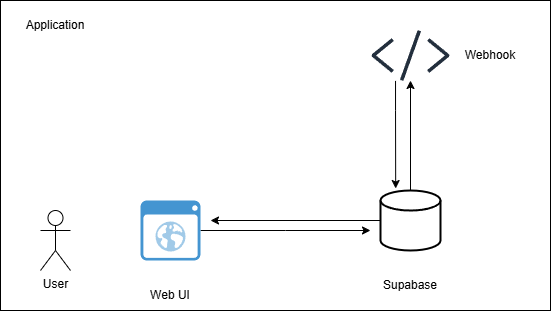
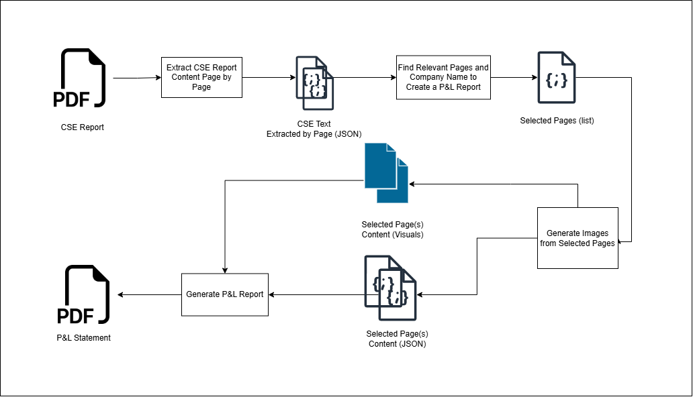

# Quarterly P&L Extraction from CSE Reports

## Overview
This project automates the extraction of key financial data from quarterly reports published by companies listed on the **Canadian Securities Exchange (CSE)**. The extracted data is then structured into a **Profit & Loss (P&L) Statement** for the latest quarter.

## Objective
Develop a system that:
- Extracts financial data from CSE quarterly reports (PDF format).
- Handles variations in report structure and formatting.
- Processes and organizes extracted data into a structured P&L statement.
- Automates the workflow using a **Vite frontend**, **Supabase backend**, and a **Flask-based webhook server**.


## Application Architecture

The system follows a **three-layered approach**:
1. **Frontend (Vite + React)**: Allows users to upload quarterly reports and view extracted data.
2. **Backend (Supabase)**: Manages data storage and triggers automation.
3. **Webhook Processing (Flask Server)**: Extracts relevant data from PDF reports and sends structured results.



## Core Approach

The system follows a **sequential AI agent workflow**:
1. **User Uploads PDF**: The system begins processing once a report is uploaded.
2. **Page-wise PDF Extraction**: The document is analyzed page by page.
3. **AI - `consolidated_income_statement_extractor`**:
   - Identifies relevant pages containing the **Consolidated Income Statement**.
   - Filters out unnecessary pages based on content analysis.
4. **Image Extraction for Selected Pages**:
   - Converts necessary pages into images for better text recognition.
5. **AI - `pnl_data_extractor`**:
   - Analyzes extracted images and retrieves structured financial data.
   - Ensures completeness and accuracy for Profit & Loss statement creation.
6. **Final Processing & Output Generation**:
   - Uses extracted data to construct a structured Profit & Loss report.




## Key Features

1. **Sequential AI Agent Processing:**
   - `consolidated_income_statement_extractor`: Filters relevant pages for processing.
   - **Image Processing Tool**: Extracts necessary visuals from reports.
   - `pnl_data_extractor`: Extracts structured P&L data from image-based reports.
   - Final function: Structures extracted data into a P&L report.

2. **Error Handling Mechanism:**
   - Each agent has its own validation system.
   - If a user uploads an irrelevant document, errors are thrown with meaningful messages.
   - Ensures only valid financial data is processed.

3. **Automated Workflow:**
   - **Supabase Webhooks** trigger **Flask API** when a new report is added.
   - AI-driven agents ensure high accuracy in data extraction.
   - Logs inconsistencies or missing data.


## Evaluation and Scoring

To assess the **accuracy and effectiveness** of the extraction system, we use the following evaluation metrics:

### 1. **Extraction Accuracy (EA)**

Measures how accurately the system extracts numerical and textual data from the report:

```math
EA = \frac{Correctly Extracted Fields}{Total Expected Fields} \times 100
```
- **Score Range:**
  - **90-100%** → Excellent
  - **75-89%** → Good
  - **50-74%** → Average
  - **Below 50%** → Needs Improvement

### 2. **Page Relevance Score (PRS)**
Evaluates how accurately the consolidated_income_statement_extractor selects relevant pages:

```math
PRS = \frac{Correctly Identified Pages}{Total Relevant Pages} \times 100
```

- **High score** indicates precise filtering of necessary content.
- **Low score** may indicate excessive inclusion or exclusion of pages.

### 3. **Error Handling Efficiency (EHE)**
Evaluates how effectively the system detects and prevents invalid or irrelevant inputs:

```math
EHE = \frac{Correctly Handled Errors}{Total Invalid Inputs} \times 100
```

- **Score above 90%** → System is robust against user errors.
- **Below 70%** → Needs improvement in error handling.

### 4. **Processing Time (PT)**
Measures the time taken for complete processing:

```math
PT = End Time - Start Time
```

- **Target:** Keep PT under **10 seconds per report**.
- A lower PT ensures efficiency without compromising accuracy.


### Evaluation on Provided Reports

For the two given CSE reports with 20 test runs:
1. **Report 1** [CSE Report PDF](https://cdn.cse.lk/cmt/upload_report_file/771_1730893408597.pdf):
   - **EA:**# %
   - **PRS:** #%
   - **EHE:** #%
   - **PT:** # seconds


2. **Report 2** [CSE Report PDF](https://cdn.cse.lk/cmt/upload_report_file/670_1731321532619.pdf)
   - **EA:** #%
   - **PRS:** #%
   - **EHE:** #%
   - **PT:** # seconds


## Assumptions & Limitations

### Assumptions:
- Reports contain **Group or Consolidated Statements** where available.
- Only **P&L Statements** are extracted (Balance Sheets & Cash Flows are ignored).
- Financial terms in reports follow standard accounting nomenclature.
- All the PDF reports consist of computer-based PDFs instead of scanned images
### Limitations:
- Variations in naming conventions may require further refinements.
- Extraction accuracy depends on the **PDF format and quality**.
- This will ***not*** work for **image-scanned PDF files**.

## Development & Setup
For detailed setup instructions, refer to:
- **[Frontend Setup](frontend/README.md)** (Vite + React UI)
- **[Supabase Backend](backend-scripts/README.md)** (Database & Webhooks)
- **[Flask Webhook Server](data-extractor-webhook/README.md)** (PDF Processing API)

## Conclusion
This project automates financial data extraction from CSE quarterly reports, leveraging **AI-driven agents** for structured processing.
